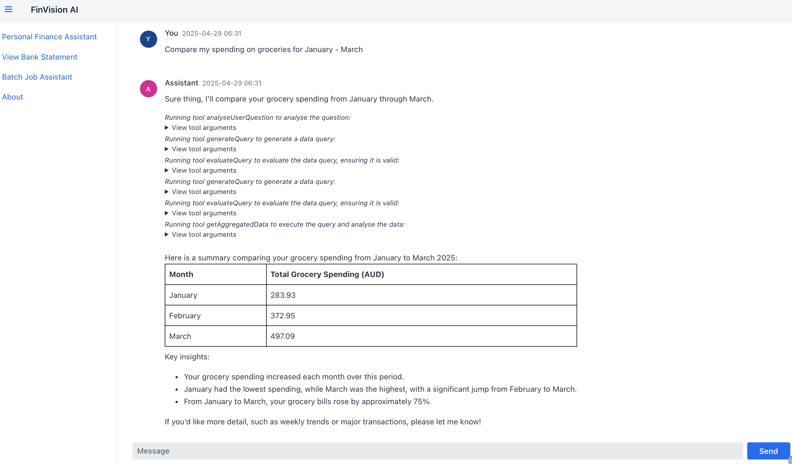
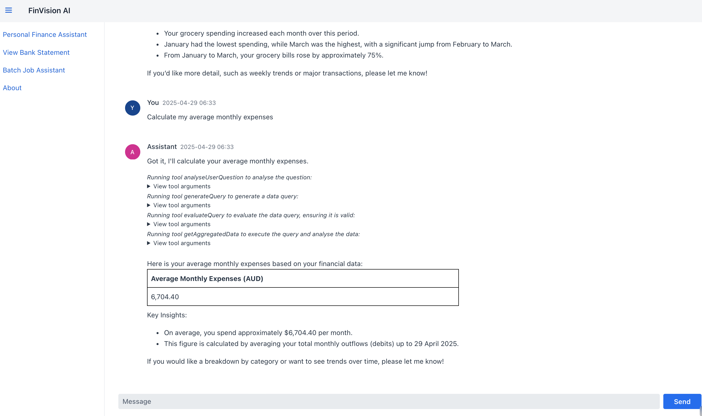
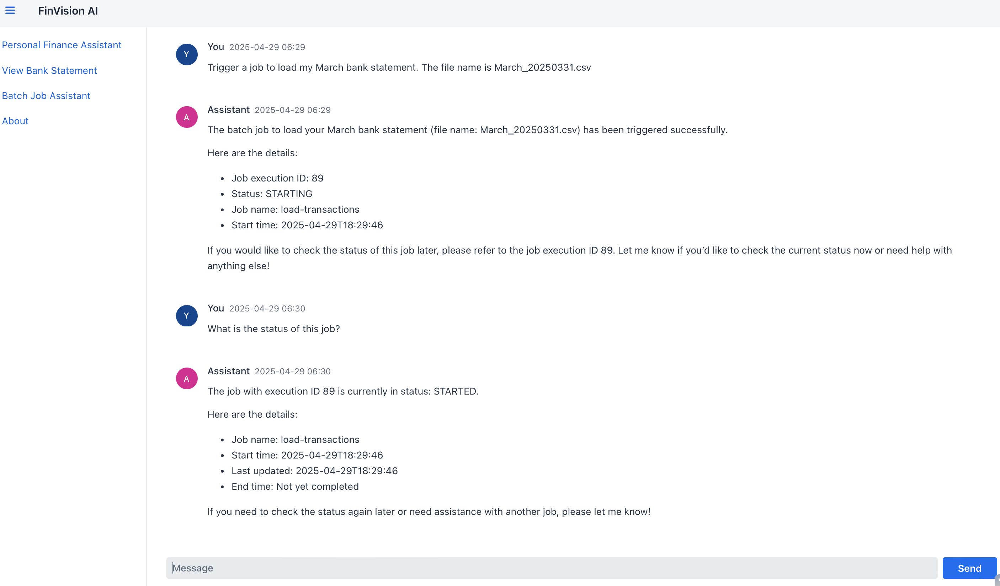
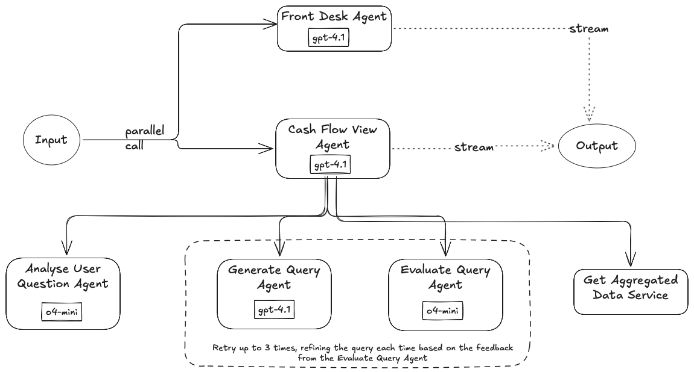
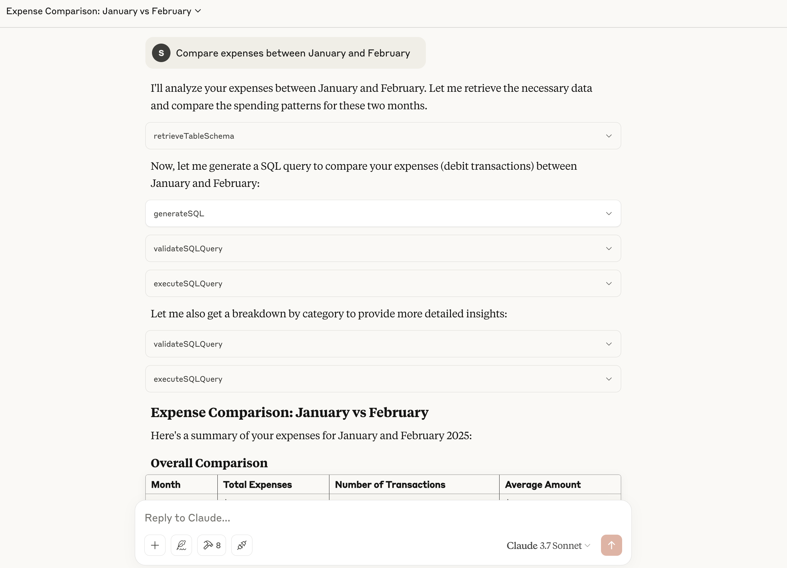
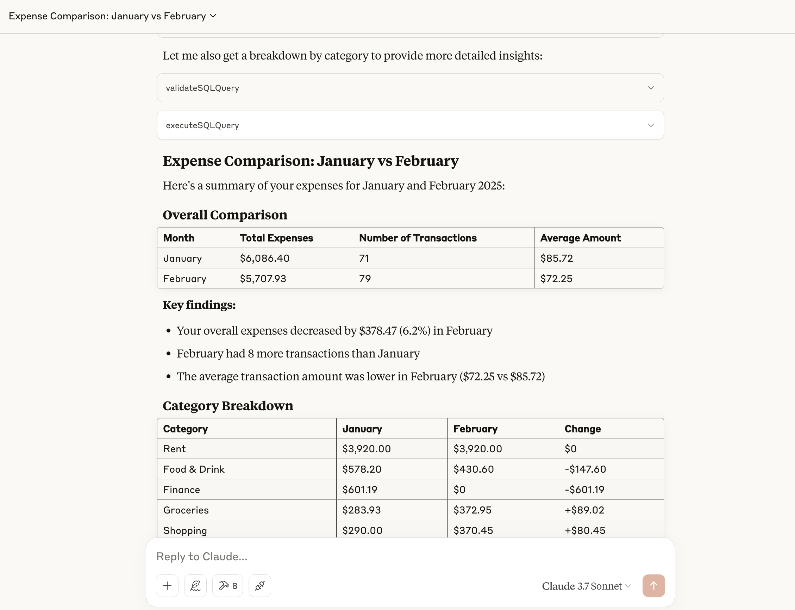

# FinVision AI
## Overview
FinVision AI is a comprehensive ecosystem of applications designed to help users manage their finances through intelligent automation and AI-powered assistance. The platform combines transaction analysis, budget tracking, and AI-powered financial insights to provide users with a comprehensive view of their financial health and actionable recommendations for improvement.

## AI Capabilities
FinVision AI leverages several AI capabilities across its applications:
- **Intelligent Financial Assistant**: Users can ask questions about their finances in everyday language and receive detailed visualizations and insights.
- **Batch Processing**: AI-assisted batch job management for large transaction processing. Efficiently handles large volumes of financial data, enabling users to import entire financial histories for comprehensive analysis.
- **Transaction Categorization**: Smart categorization of expenses using AI
- **Bank Statement Analysis**: Upload and automatically categorize bank transactions using AI
- **Real-time Analysis**: Interactive financial data analysis and visualization
- **Model Context Protocol**: Connects with MCP clients like Claude Desktop, enabling access to financial data.

Refer to the README files in each application's directory for information on the **AI Agents** used in the applications.

## Project Components
### 1. Personal Finance Manager
The Personal Finance Manager is the core application for tracking daily financial activities. It allows users to:
- Import and categorize transactions
- Trigger a batch job to process a financial transactions file
- Manage spending categories
- Track and analyze budgets
- Monitor financial health metrics
- Generate insights about spending patterns
#### Technology Stack
- Frontend: Vaadin Flow
- Backend: Spring Boot, Java 21
- AI Framework: Spring AI
- Database: PostgreSQL

#### High Level Architecture of the Personal Finance Assistant View

[More details on the Agentic patterns used in this application can be found in the Personal Finance Manager project directory](https://github.com/iAMSagar44/finvision-ai/tree/main/app/personal-finance-manager)

### 2. Model Context Protocol (MCP) servers
MCP is an open protocol that standardizes how applications provide context to LLM.
The following MCP servers can be plugged into a MCP Client like Claude Desktop.
#### personal-finance-analysis MCP server
This MCP server exposes tools for advanced financial analysis and assistance. Key features include:
- Personalized financial advice based on transaction history
- Budget optimization recommendations
- Spending habit analysis
- Financial goal planning assistance
- Interactive financial health dashboard
#### Technology Stack
- Backend: Spring Boot, Java 21
- AI Integration: Spring AI
- Database: PostgreSQL

  
[More details on the AI Agents and tools exposed can be found in the personal-finance-analysis MCP project directory](https://github.com/iAMSagar44/finvision-ai/tree/main/mcp-servers/personal-finance-analysis-mcp)
#### batch-jobs MCP server
This MCP server exposes tools for automated processing of financial data in batches. This component:
- Processes large volumes of financial transactions
- Schedules and monitors batch processing jobs
- Provides job management capabilities (start, restart, status tracking)
- Ensures efficient handling of financial data imports
#### Technology Stack
- Backend: Spring Boot, Java 21
- AI Integration: Spring AI
- Batch Processing: Spring Batch
- Database: PostgreSQL
  
[More details on the AI Agents and tools exposed can be found in the batch-jobs MCP project directory](https://github.com/iAMSagar44/finvision-ai/tree/main/mcp-servers/batch-job-mcp)
  
## Getting Started
Each component of FinVision AI has its own setup and usage instructions. Please refer to the README files in each application's directory for detailed information:
- [Personal Finance Manager Documentation](https://github.com/iAMSagar44/finvision-ai/blob/main/app/personal-finance-manager/README.md)
- [personal-finance-analysis MCP Documentation](https://github.com/iAMSagar44/finvision-ai/blob/main/mcp-servers/personal-finance-analysis-mcp/README.md)
- [batch-jobs MCP Documentation](https://github.com/iAMSagar44/finvision-ai/blob/main/mcp-servers/batch-job-mcp/README.md)
